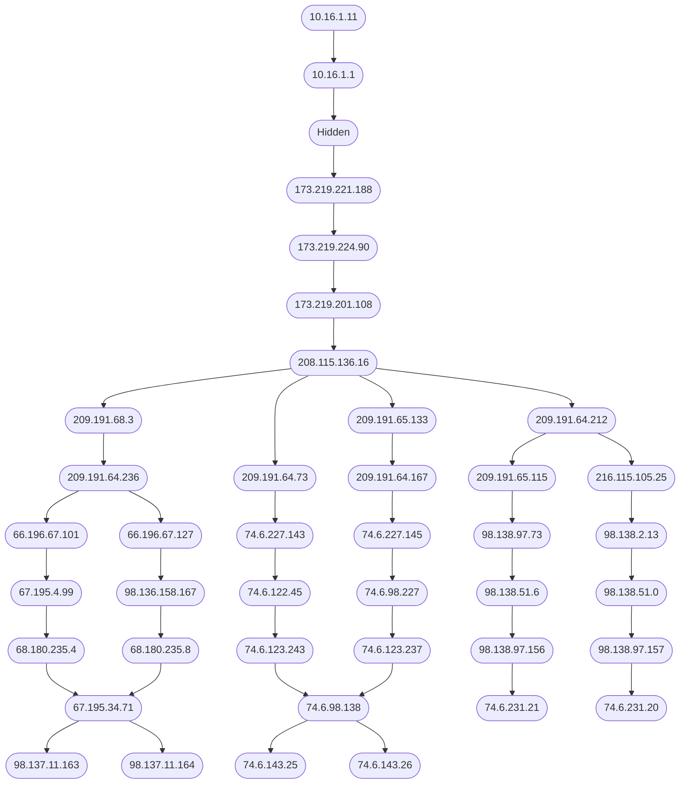

# Traceroute
Network diagnostic tool to capture route and transit delay of packets.

My motivation for building this was to explore oddities in internet routing.
Specifically providers which send traffic through multiple routes for the same
destination, unoptimal routing, and bad performance routers along the path.

# Usage

For Nix users
```
# jump into development shell with tools and environment setup
nix develop

# for a typical traceroute experience
cargo run -- yahoo.com

# for a graph view
cargo run -- --graph yahoo.com | xdot -
```

For general linux users
```
# command needs to sudo to receive ICMP packets
export CARGO_TARGET_X86_64_UNKNOWN_LINUX_GNU_RUNNER = "sudo -E";

# for a typical traceroute experience
cargo run -- yahoo.com

# for a graph view
cargo run -- --graph yahoo.com | xdot -
```

## Goals
Use all known methods to discover the route/s to be taken by a packet to a target
Deduce latency of hops and target.
Use collected data to build directed graph of perceived network.

## Related Projects
### [dublin traceroute](https://github.com/insomniacslk/dublin-traceroute) [traceroute] [c++] [go]
Dublin Traceroute is a NAT-aware multipath traceroute

### [traceroute-rs](https://github.com/daniellockyer/traceroute-rs) [traceroute] [rust]
Traceroute implemented in ~165 lines of rust

### [fastping-rs](https://github.com/bparli/fastping-rs) [ping] [rust]
fastping-rs is a Rust ICMP ping library, inspired by [go-fastping](https://github.com/tatsushid/go-fastping)  and the [AnyEvent::FastPing Perl module](http://search.cpan.org/~mlehmann/AnyEvent-FastPing-2.01/), for quickly sending and measuring batches of ICMP ECHO REQUEST packets.

### [libtraceroute](https://github.com/ilyagrishkov/libtraceroute) [traceroute] [rust]

### [ping.rs](https://gist.github.com/nixpulvis/e2938d03d141990d99db) [ping] [rust]
A simple Ping implementation in Rust. 83 lines of rust

# Example Output
```
cargo run -- --graph yahoo.com 
```


